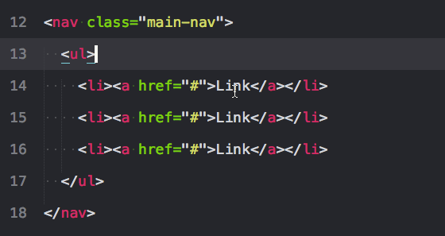

# Speed Up Your Workflow <br/> and Live the Easy Life


## Sublime Shortcuts and Package Managers


###Shortcuts: Step One to Becoming a Sublime Ninja


####*Legend:*
  * ⌘: Command Key
  * ⇧: Shift Key
  * ⌃: Control Key
  * ⌥: Alt Key

| **Shortcut Command**  | **Shortcut Function** |  |
| ------------- | ----------------- | ------------------- |
| ⌘ + ⇧ + P    | Open Command Palette| Easy Access to Installed Packages |
| ⌘ + P         | File Switching      | Searches your open directory.  See below for even more functionality. |
| ⌘ + L  | Select Entire Line     | Can repeat command to select more lines.   |
| ⌃ + Tab or ⌃ + ⇧ + Tab  | Select Next/Previous Tab      | Easily move across multiple files |
| ⌘ + [ or ⌘ + ]  | Indent forward or backward     | Allows easy management and organization of your code |
| ⌘ + ⌥ + 2  | Split into 2 windows <br/> (Can open up to 4 windows|  ⌃ + Window Number will move cursor to that window                   |
| ⌘ + ⌃ + Up/Down:  | Move selection up/down      | Can move large code chunks and paragraphs without continuously copy/pasting |
| ⌃ + ⇧ + Up/Down  | Select line above below (Multi-select)     | Multi-select is your best friend.  Use it often to really speed things up! |
| ⌃ + ⌘ + G  | Select All Instances of Selection      | Effortlessly change class, tag, and id names |
| ⌘ + K, ⌘ + V  | Paste History | Lets you keep and choose from multiple items in your clipboard. |
| ⌘ + K, ⌘ + B  | Hide Side Bar | Gives more space to see your code.  |


###⌘ + P Hack:
```
⌘ + P Will open any file in your directory.  You can chain this with the following symbols to make your search even more accurate!

# : Fuzzy Matching.  Will find by tag name, class name, etc.

: : Line Matching.

@ : Symbol Search. Very useful when navigating css
```

###Multi-Select:
Multi-select makes it easier to edit files, speeds up your work, and looks *really* cool.


<p style="color:grey" align="right">Source: Tommy Marshall. Viget.com</p>

There are multiple ways to use multi select.

  1. ⌃ + ⇧ + Up/Down: Adds a cursor directly above or below your current line.
  2. ⌃ + D: Selects the next instance of the code you have highlighted.  Repeat multiple times to select more.
  3. ⌘ + ⌃ + G: Selects ALL instances of the code you have selected.
  4. ⌥ + Click: Allows you to drag your mouse across the lines you add a cursor.

When you finish editing in multi-select, just press Esc and you are back to normal, boring, one cursor editing.


---
##Sublime Package MVPs

| **Package Name**  | **Package Use** | Link |
| ------------- | ----------------- | ------------------- |
|  Emmet   | Emmet can make your HTML and CSS workflow lightning fast! <br/>Over Has over 1.43 million users! | [Emmet Website](http://emmet.io/) <br/> [Emmet Cheatsheet](http://docs.emmet.io/cheat-sheet/) |
|  AdvancedNewFile  | Allows faster file creation within Sublime Text | [AdvancedNewFile Repo](https://github.com/skuroda/Sublime-AdvancedNewFile) |
|  Color Highlighter  | Adds unobtrusive preview colors and color picker. <br/> Open Color Picker: ⇧+⌃+C | [Color Highlighter Repo](https://packagecontrol.io/packages/Color%20Highlighter) |
|  Git & Gitgutter  | Adds git functionality within Sublime and shows changes to most recent commit in real time. | [Git for Sublime](https://github.com/kemayo/sublime-text-git) <br/> [GitGutter](https://github.com/jisaacks/GitGutter) |
|  SideBar Enhancements  | Expands your options in the sidebar and allows you to easily open files within the browser. | [SideBar Repo](https://github.com/titoBouzout/SideBarEnhancements) |
|  Sublime Linter  | Analyzes your code for potential error.  Available for CSS, Javascript, Ruby, jQuery, and more! | [Sublime Linter](http://www.sublimelinter.com/en/latest/about.html) |
|  Prettify  | Automatically indents your code to make it more readable. | [Prettify Repo](https://github.com/victorporof/Sublime-HTMLPrettify) |

<br>
<br>
If you are curious about a particular package, check out [packagecontrol.io](https://packagecontrol.io/)

---
##Emmet: Everything is AWESOME!


  Emmet is one of the biggest timesaves available to web developers today.  <br>  This package allows users to chain together tag names, class names, and special characters to create markup in just a couple easy steps!

  1. Write a tag name (ex. div, ul, or p) or class name (.container, .logo, or .blog)
  2. Chain together tags and classes with the following characters.
    1. **>** :Child Element
    2. **+** :Sibling Element
    3. **^** :Move Up
    4. * :Create Multiple Items
  3. After you finish writing out your chain, press Tab.
  4. :raised_hands: PRAISE EMMET :raised_hands:


  For example:
  This:
  ```
    div.container>div+p*3+ul>li*6^p
  ```
  Becomes this:
  ```HTML
    <div class="container">
      <div></div>
      <p></p>
      <p></p>
      <p></p>
      <ul>
        <li></li>
        <li></li>
        <li></li>
        <li></li>
        <li></li>
        <li></li>
      </ul>
      <p></p>
    </div>
  ```


===
###Advanced:
####Running Javascript inside of Sublime Text 3 (for OSX):
  1. Make sure you have node installed
  2. Go to Tools --> Build System --> New Build System
  3. A file named untitled.sublime-build should open and look like this

    ```JSON
    {
      "shell_cmd": "make"
    }
    ```

  4. Insert the following code:

    ```JSON
    {
      "shell_cmd": "node ${file}",
      "selector" : "source.js"
    }
    ```

  5. Save the file as Node.sublime-build
  6. Go back to Tools --> Build System and select Node.
  7. Press ⌘ + B in the file you want to run.
  8. **?????**
  9. Profit!

===

##Resources and Extra Links

===
  + [ShortcutFoo! Memorize keyboard commands by fighing ninjas!](https://www.shortcutfoo.com/app/dojos/sublime-text-3-mac)
